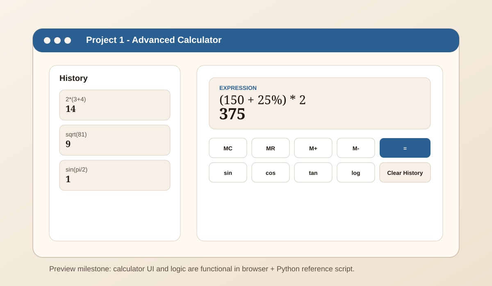

# Freetime Projects

Portfolio-style project collection focused on three browser projects that are being built step by step.

## Current projects

- **Project 1: Advanced Calculator**
  - Goal: Build a calculator with both standard and advanced operations.
  - Current stage: In Progress (functional build complete, now polishing and extending controls).

- **Project 2: Advanced Calendar**
  - Goal: Build a structured calendar with richer date/event views.
  - Current stage: Planning.

- **Project 3: Tetris Game**
  - Goal: Build a browser Tetris with clean controls, scoring, and line-clear logic.
  - Current stage: Planning.

## Project status badges

These badges are now visible on the homepage and each project page.

| Project | Badge |
| --- | --- |
| Project 1: Advanced Calculator | In Progress |
| Project 2: Advanced Calendar | Planning |
| Project 3: Tetris Game | Planning |

## Repository structure

- `index.html` - Homepage with project cards
- `project1.html` - Advanced Calculator page
- `project2.html` - Advanced Calendar page
- `project3.html` - Tetris Game page
- `script.js` - Browser interactivity, currently used by the calculator page
- `script.py` - Python reference calculator engine for reviewing the same expression logic outside the browser
- `server.js` - Simple local Node.js server for running the site on localhost
- `styles.css` - Shared design system used by all pages
- `assets/previews/calculator-preview.svg` - Visual preview image for implemented calculator milestone

## Run locally

This is primarily a static HTML/CSS/JS project, so no required dependencies are needed for browser use.

No extra tools are required to run the website itself.

### Option 1

Open `index.html` directly in a browser.

### Option 2

Use VS Code Live Server and open the project from a local URL.

### Option 3

Run a simple local server from this folder:

```bash
python -m http.server 5500
```

Then open `http://localhost:5500`.

### Option 4

Run the Node.js server from this folder:

```bash
node server.js
```

Then open `http://localhost:3000`.

## Optional tools

- **Node.js** (optional): useful for JavaScript tooling and syntax checks, but not required to open the site.
- **Python** (optional for browser use, useful for this project): used by `script.py` to mirror calculator logic in a second language.

If you install Node and the `node` command is not recognized in VS Code terminal, restart VS Code (or your PC) so PATH refreshes.

## Python logic preview

The calculator logic is also mirrored in `script.py` so the project shows both JavaScript and Python.

```bash
python script.py "2*(3+4)"
python script.py --action sqrt "81"
python script.py --action log "1000"
```

## Visual preview (implemented milestone)



## Milestone tracker

- [x] Expand the calculator with more scientific actions or history controls before moving to the calendar
  - Implemented: history pinning, clear history, and single-entry remove control.
- [x] Add a small "status" badge per project (Planning / In Progress / Completed)
  - Implemented on homepage cards and project headers.
- [x] Add screenshots or short GIF previews when features are implemented
  - Implemented: calculator preview image added.
- [x] Add a short changelog section to track milestones
  - Implemented below.

## Changelog

- 2026-03-17
  - Calculator functionality extended and simplified for beginner-friendly flow.
  - History controls now include pin, clear, load, and single-entry remove.
  - Status badges added across homepage and project pages.
  - Visual preview image added for calculator milestone.
  - Node.js local server included (`server.js`) for localhost workflow.

## Contact

- LinkedIn: https://www.linkedin.com/in/tarik-j-51a341249/

---

_Last updated: 2026-03-17_
